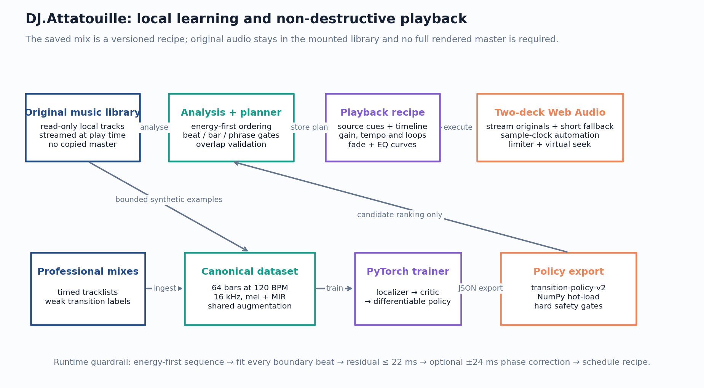
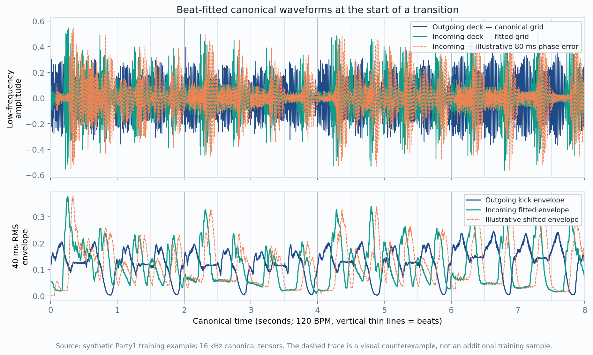
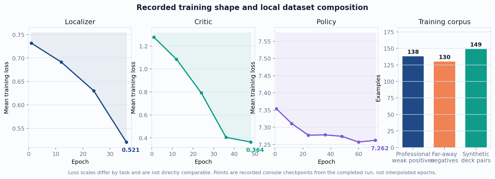
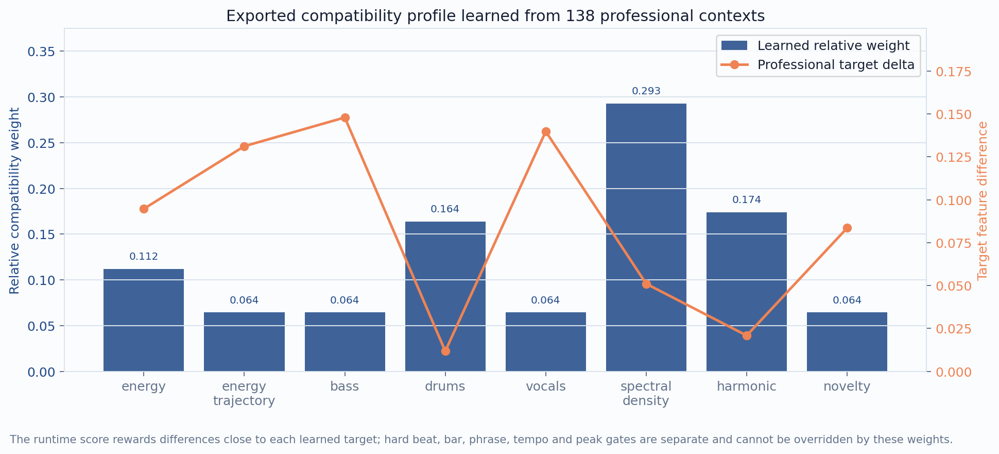

# DJ.Attatouille: Local-First Beat-Synchronous DJ Mixing

**Technical project paper — revised 7 September 2026**

## Abstract

DJ.Attatouille is a local-first music preparation, mixing, and playback system for small parties. It analyses a mounted music library, stores musical structure and similarity data locally, orders the crate by measured energy, and plans phrase-aware track changes. The revised runtime model stores a compact, non-destructive playback recipe—source cues, gains, tempo factors, loops, fade curves, filter automation, and safety decisions—instead of requiring one full-length rendered mix. A two-deck player can then execute that recipe against the original files, with short rendered bridges retained only as a compatibility fallback. The project combines deterministic musical safety rules with an offline learned transition policy. A learned policy may rank *safe* candidates, but it may not override beat, downbeat, bar, phrase, tempo, or peak constraints.

This report documents the revised playback architecture, the transition-learning pipeline, the completed 36/48/72-epoch training run over 417 canonical examples, and the exported `transition-policy-v2` runtime policy. It also records the energy-led ordering change, beat fitting used to avoid low-frequency kick drift, the high-resolution playback waveform, and virtual-timeline seeking. The figures are generated from the local manifest, exported model, and one canonical synthetic training tensor; no audio recording is embedded in this paper.



*Figure 1. The revised online path stores a compact playback recipe and reads the original tracks at play time. The offline learning path remains separate; only the compact JSON policy crosses into runtime.*

## 1. Project goal

The project aims to make a long local music library usable as a coherent party mix without uploading songs or depending on a hosted music service. A good transition must meet more than a BPM target: bar boundaries, phrase endpoints, kick phase, energy trajectory, bass ownership, vocal density, harmonic movement, loudness, and peak headroom can all make an otherwise compatible pair sound unnatural.

The current iteration addresses six concrete playback, storage, and quality issues:

1. Fit the incoming tempo against every paired beat in the overlap, including the actual crossfade boundary, rather than comparing relative beat sequences that can hide a starting phase error.
2. Correct a tiny remaining low-frequency onset mismatch only when rendered-audio correlation supports it.
3. Keep the visual waveform accurately mapped to mix time and increase its resolution to 64 samples per beat.
4. Make the playback timebar directly seekable on both desktop and mobile.
5. Sequence the complete crate by measured energy rather than placing tracks into genre buckets that can force low- and high-energy records together.
6. Replace the full-length mix artifact with a versioned playback recipe, allowing the player to use the original local tracks and avoiding standard WAV/RIFF's 4 GiB size ceiling.

The corresponding training change gives clearly unrealistic synthetic transitions more influence in the critic and adds a policy penalty when critic realism remains below 0.78.

## 2. System and used projects

The application is intentionally split into a responsive runtime path and an offline learning path. The following open-source components and project modules are used.

| Layer | Technology / project | Role |
| --- | --- | --- |
| Player | React, Vite, Web Audio API, Tailwind CSS | Responsive two-deck UI, original-file streaming, scheduled gain/EQ/fade automation, waveform display, play/pause, Next, and direct virtual-timeline seek. |
| API | Rust, Axum | HTTP routes, preparation/mix orchestration, typed worker calls, and persistent job state. |
| Audio worker | Python, FFmpeg, librosa, pydub | Decode, loudness/feature extraction, beat/phrase analysis, recipe planning, overlap validation, and optional short bridge generation. |
| Structure model | Harmonix via `all-in-one-infer` | Local beat/downbeat, phrase/section, genre, and embedding analysis. The fast profile avoids full-track stem separation. |
| Local data | MongoDB and Qdrant | Preparation records, compact playback recipes, and 512-dimensional track-vector similarity search. Original audio remains in the mounted library. |
| Offline trainer | Python, NumPy, PyTorch | Canonicalisation, weak transition localization, realism critic, differentiable mixer, policy optimisation, and JSON export. |
| Deployment | Docker Compose | Frontend, API, worker, MongoDB, and Qdrant; the trainer is opt-in and never runs during normal playback. |

The system works from a read-only `/music` mount. MongoDB stores track, job, and playback-plan records, while Qdrant stores embeddings. The worker can use Harmonix/all-in-one locally when available and has a lightweight librosa fallback. The model cache and data stay local; no API key and no media upload are required.

The current repository already persists most recipe fields in playlist items and transition records, but its production playback path still renders and consumes one complete mix file. The recipe executor described in Section 3.4 is the migration target: until that executor replaces the renderer, claims about storage reduction and real-time original-file playback are architectural specifications rather than completed runtime measurements.

## 3. Analysis, mixing, and safety gates

### 3.1 Preparation features

For every track, preparation extracts metadata and cover art, BPM, key, EBU R128 loudness, energy, beat/downbeat/bar grids, explicit eight-bar phrase states, genre, a 512D vector, and waveform representations. Phrase states retain energy and slope, bass/drum/vocal activity, spectral and harmonic density, novelty, loopability, and cue confidence. These values let the planner avoid mixing through the middle of a drop, peak, or build.

The planner now sorts the whole candidate set from low to high measured energy. BPM and title are deterministic tie-breakers only; genre is retained as descriptive metadata and a low-weight compatibility feature, not as an ordering boundary. Consequently, a low-energy techno track may precede a higher-energy house track instead of being pulled into an unrelated genre block. Phrase-level selection can still reject a technically unsafe adjacency, but it cannot reintroduce genre bucketing.

Tempo conversion must remain pitch-preserving, so speed correction does not deliberately shift voices or musical key. In the revised runtime model, the player applies bounded per-track trim toward −14 LUFS, schedules filter and fade automation, and protects the summed master with a real-time ceiling. If a platform cannot guarantee a required pitch-preserving tempo or phase operation, the worker may render only that short transition bridge with FFmpeg rather than materialising the complete set.

### 3.2 Boundary-inclusive beat fitting

The previous relative-grid comparison could measure drift while failing to penalise a phase error exactly at the crossfade start. The current `beat_overlay_fit` first requires each cue span to begin and end within 35 ms of detected beats. It then uses all aligned beats, including the origin, to fit the incoming tempo factor.

For outgoing beat offsets \(y_i\) after its tempo correction and incoming source offsets \(x_i\), the least-squares factor is:

\[
f_{in} = \frac{\sum_i x_i^2}{\sum_i x_i y_i}.
\]

The rendered offsets are compared as \(y_i\) and \(x_i/f_{in}\). A transition may use an overlapped beat-matched blend only if the 95th-percentile residual is at most **22 ms**. An invalid, unanchored, or unequal beat grid is not forced into an overlay; the system instead uses a phrase-boundary handoff. This is deliberately stricter than score-based ranking.

Before finalising an otherwise legal overlap, the worker can decode only the required source windows, low-pass both decks below 240 Hz, build five-millisecond onset envelopes, and search a maximum ±24 ms shift. The correction is stored in the recipe and applied only if the non-zero offset has a meaningful correlation advantage and a correlation of at least 0.18. It is therefore a narrowly scoped final kick-phase correction, not a way to rescue a bad grid fit and not a reason to render the full mix.



*Figure 2. A Party1-derived synthetic example represented on the canonical 120-BPM grid. The lower panel makes beat placement visible as a 40 ms RMS kick envelope. The orange dashed curve is the same incoming signal shifted by an illustrative 80 ms; it is not a separate sample or a claimed measurement.*

### 3.3 Accurate high-resolution waveform and seeking

The worker now stores a compact overview envelope alongside an 8-bit detailed waveform at **64 samples per beat** (with a minimum of 1,024 points). Both envelopes are binned directly from decoded audio, so their zero and duration match the beat grid instead of stretching a lower-rate RMS feature stream. Its cache version is `track-analysis-v5-source-timed-waveform`, so existing tracks are refreshed rather than served with the previous mismapped detail payload.

The player maps waveform highlighting to elapsed virtual-mix time even while playback is paused, so the shown region remains the region that is actually playing. The timebar is a native range control in both desktop and mobile layouts. Seeking resolves the active recipe item and maps virtual time (t) to original source time:

\[
t_{source}=t_{sourceStart}+(t-t_{timelineStart})f_{tempo}.
\]

Both decks are then rescheduled from the corresponding source cues. This preserves a continuous user-facing timeline without requiring one continuous audio file.

### 3.4 Non-destructive playback recipe

A prepared mix is represented as an edit decision list plus automation. It stores references and instructions, never copies of the original songs:

| Recipe scope | Required values |
| --- | --- |
| Track placement | Track ID and relative path, source start/end, virtual timeline start/end, source BPM, deck BPM, tempo factor, and gain in dB |
| Transition timing | Outgoing exit, incoming entry, overlap duration/bars, beat/bar/phrase flags, fitted residual, and optional low-frequency phase offset |
| Automation | Timestamped or normalised gain and low/mid/high filter curves, fade definitions, bass-swap point, and master ceiling |
| Loop | Explicit source start/end, loop count or destination duration, crossfade, and the condition that enabled it |
| Fallback | Optional short bridge URL, fallback reason, and resume point into the original incoming track |

At play time, two streaming media elements feed separate Web Audio processing chains. Each deck has gain and three-band filtering; both feed a common compressor/limiter. Automation is scheduled against `AudioContext.currentTime` rather than JavaScript timers. The next source is opened before its cue, and its controls are scheduled as one transaction so UI rendering delays do not move the transition.

Filter and fade values are stored as automation curves with explicit time coordinates, not as single snapshots. Loop boundaries are also explicit, avoiding ambiguity if the transition algorithm changes later. A versioned schema, source-file size/mtime or content fingerprint, and policy version make a saved mix reproducible and allow the player to reject a recipe when an original file has been changed or removed.

This design reduces each saved mix from a potentially multi-gigabyte PCM intermediate or large encoded master to kilobytes of JSON/BSON plus, at most, a few short bridge files. It also removes the standard RIFF/WAV 32-bit chunk-size failure at 4,294,967,295 bytes from the normal playback path. Canonical training tensors remain separate bounded examples and are unaffected by this storage decision.

## 4. Offline transition-learning design

Learning is offline and is not part of live audio playback. It uses professional mixes with timed tracklists as weak supervision plus deterministic Party1 deck-pair renderings as artificial examples. The data contract is the same across domains:

- 44.1 kHz stereo PCM with common bandwidth limits, −14 LUFS target, and −1 dB true-peak ceiling;
- pitch-preserving, beat-warped 16 kHz model input on a common 120-BPM clock;
- 64 bars per example: 16 bars context before, 32 transition bars, and 16 bars context after;
- exactly 8,000 samples per beat (32,000 per bar), 64-bin mel features, and 24 MIR values per bar; and
- the same gain, broad-EQ, bandwidth, codec/quantisation proxy, noise, and mastering augmentation in both domains.

This common representation prevents the critic from learning only source-domain artefacts such as different sample rate, bandwidth, or mastering treatment.

### 4.1 Stage 1: weak multiple-instance localizer

Professional tracklist timestamps define ±45-second candidate bags rather than exact labels. The localizer learns a per-bar transition probability from mel, MIR, and bar masks. For each positive bag, it needs at least one likely transition bar; negatives sampled far from a boundary are trained to remain quiet. The localized interval is then stored back into the manifest for the next stage.

### 4.2 Stage 2: realism critic

The critic distinguishes professional contexts from synthetic deck-pair transitions and predicts auxiliary diagnostics: phrase alignment, energy smoothness, bass separation, spectral smoothness, duration, strength, and location. Synthetic samples are technically legal rather than random corruption, so a false professional judgement on a synthetic transition carries a **1.35×** realism weight. Auxiliary weights further emphasise phrase alignment (1.30), energy (1.20), bass separation (1.55), spectral smoothness (1.15), duration (1.00), and strength/location (1.05).

### 4.3 Stage 3: differentiable policy

The policy receives phrase-candidate features and predicts overlap phrase count, bass-swap position, nonlinear fade curves, three-band EQ handoff, optional loop probability, and timing score. A differentiable mixer renders those controls and the frozen critic evaluates the result. The objective is not a direct assertion of human preference; it combines critic realism, diagnostics, peak protection, legal phrase shape, bass-swap cost, control priors, and timing calibration.

The new bad-transition term is:

\[
\mathcal{L}_{bad}=\operatorname{mean}\left[\max(0,0.78-\sigma(r))^2\right],
\]

where \(r\) is the critic realism logit. It is weighted by 0.80 in the policy objective. Policy diagnostics also increase bass separation to 1.80 and phrase/energy-related terms to 1.30 and 1.20. This puts extra curvature on clearly implausible results rather than allowing a small control gain to trade away naturalness.

At export, only a small three-layer policy and a learned compatibility profile are written to JSON. The live worker loads it through NumPy. The professional audio, localizer, critic, and PyTorch dependency stay offline, while hard beat/bar/phrase/tempo/high-energy/peak gates retain final authority.

## 5. Training run and results

### 5.1 Dataset and schedule

The completed local run used **417** manifest rows. The synthetic domain includes a refreshed adjacency pass over the expanded 145-track Party1 crate together with retained unique examples from earlier passes:

| Domain | Count | Used by |
| --- | ---: | --- |
| Professional weak positives | 138 | Localizer, critic, compatibility profile |
| Far-away negatives | 130 | Localizer |
| Synthetic Party1 deck pairs | 149 | Critic, policy |

Training ran on CPU because Metal/MPS was unavailable in the execution environment. The schedule was intentionally extended from the earlier defaults to 36 epochs for the localizer, 48 for the critic, and 72 for the policy.

| Stage | Epochs | Final recorded mean loss | Additional recorded result |
| --- | ---: | ---: | --- |
| Localizer | 36 | 0.521045 | 138 transitions localized |
| Critic | 48 | 0.363582 | Synthetic false-positive realism weighted 1.35× |
| Policy | 72 | 7.262072 | Exported `transition-policy-v2` |



*Figure 3. The plotted values are recorded console checkpoints from the completed run; they are not an invented dense loss history. Each task has a different objective and loss scale, so the vertical values cannot be compared across panels.*

The localizer and critic losses decline steadily at the recorded checkpoints. The policy loss ends lower than it began, although it is noisier because it optimises controls through a mixer and a frozen critic. These losses are training objectives, not a perceptual listening score and not proof on their own that all transitions are natural.

### 5.2 Learned compatibility profile

The exported profile uses 138 professional contexts to learn which differences are informative and what controlled difference is typical. The largest relative weights in this run are spectral density (0.292681), harmonic mismatch (0.173874), and drum activity (0.163708). This should be read as a context-ranking aid rather than permission to break timing gates.



*Figure 4. Runtime compatibility weights and target deltas from the exported policy. A feature is best when its observed difference is near its learned target; low values are not universally better.*

### 5.3 Runtime artifact and recipe migration

The trained artifact is stored locally at `../.dj-attatouille-data/models/transition-policy-v1.json`. Its internal runtime identifier is `transition-policy-v2`; it records 72 policy epochs, 138 professional examples, 149 synthetic examples, the final loss above, and the bad-transition description `critic-realism<0.78, weighted bass/phrase diagnostics`. The fixed filename lets the worker hot-load an updated policy without pulling PyTorch into the runtime.

The revised playback recipe does not change this learned policy or the hard planner gates. It changes the execution artifact: instead of assigning an `audioUrl` to a full master, the API persists the playlist and transition controls and the player opens the referenced library files. Existing mix records can remain readable during migration by treating a full `audioUrl` as a legacy fallback. New records should carry a recipe schema version and may carry only short bridge URLs where a platform-specific operation cannot be reproduced safely in real time.

## 6. Verification performed

The implementation was checked with the following project validations after the changes:

- frontend production build completed successfully;
- Rust backend `cargo check` completed successfully;
- worker test suite: 27 passing tests;
- trainer test suite: 14 passing tests; and
- `git diff --check` completed without whitespace errors.

The worker health response after policy deployment reported `transitionPolicy: "transition-policy-v2"` and `analysisDevice: "mps"`; the training run itself used CPU because MPS was unavailable to that trainer process. This confirms the runtime loaded the new export. It does not replace listening-based evaluation of a finished Party1 mix, and it does not imply that the recipe executor has already replaced the current full-file renderer.

## 7. Limitations and next evaluation

The learned policy now has 149 synthetic deck-pair examples, but no held-out subjective listening panel is reported here. The training losses establish that the optimisation ran and improved its own objective; they do not quantify a percentage improvement in perceived naturalness.

A sound evaluation should play a fixed blinded set of candidate transitions through both the legacy renderer and the recipe executor, then compare them with DJs/listeners on beat synchrony, bass clashes, phrase placement, level consistency, seeking recovery, and overall naturalness. The existing optional 1–5 human-rating path can calibrate critic realism before a further policy pass. Candidate-level logs should retain the fitted residual, phase offset, scheduler lateness, fallback reason, and real-time output peak so that every audible failure is traceable to a gate or control decision.

The main engineering risk in the revised runtime is browser scheduling and pitch-preserving tempo behavior across platforms. Media elements are stream-friendly but less deterministic than fully decoded audio buffers; full buffers offer precise scheduling but can consume substantial memory. The hybrid bridge fallback bounds that risk while still eliminating the full-length mix file. The player also needs underrun handling, range-request support, source fingerprint validation, and deterministic reconstruction after seeking into an active overlap.

## 8. Reproducibility

The figures in this paper are reproducible from the local artifacts with:

```sh
MPLCONFIGDIR=/tmp/dj-attatouille-paper-matplotlib \
  ./.venv-mps/bin/python paper/generate_figures.py
```

The generator reads the manifest at `../.dj-attatouille-training/manifest.jsonl`, a single canonical synthetic tensor, and the exported policy JSON. It writes only the four PNG figures in `images/`. Training commands, the canonical representation, and platform-specific MPS/Compose guidance are documented in the project README.

## 9. Responsible-use note

Professional mixes and timed tracklists are used as local weak-supervision references. Operators must have the necessary rights to use any reference recordings. The system is designed to analyse and play local music, with optional short local bridge rendering; it does not make media rights decisions or upload media to a third party.
